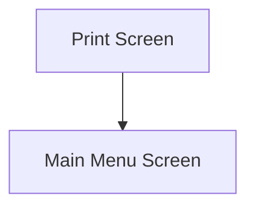

This screen is used to reprint the Kanban Receipts transaction

# Flow

# When This Page Is Loaded
The printers are retrieved from Epicor
- See [How MIMS Retrieves The Available Printers](../../../../Printing.md#how-mims-retrieves-the-available-printers)

The [Selected Printer](#printer) is set to the first default Printer

# Controls
## Printer
This control is used to select a Printer from the list of available Printers

## Print
This control is used to reprint the Kanban Receipts transaction

### When This Button Is Tapped
The app will validate the selection

If no [Printer](#printer) has been selected
- An error with the message, "Please select a printer", is shown

The report is printed in the same way as in [Kanban Receipts](../../../Kanban_Receipts/Kanban_Receipts.md)
- See [Printing](../../../Kanban_Receipts/Epicor_Processes.md#printing)

The app then navigates to the [Home Page](../../../Home_Page.md)