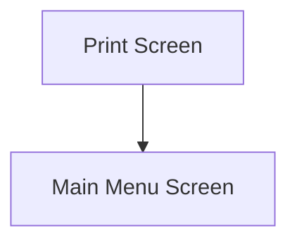

This screen is used to reprint a PO Receipt

# Flow

# When This Page Is Loaded
The printers are retrieved from Epicor
- See [How MIMS Retrieves The Available Printers](../../../../Printing.md#how-mims-retrieves-the-available-printers)

The [Selected Printer](#printer) is set to the first default Printer

# Controls
## Pack Slip Number
This control is used to input the Package Slip Number

## Printer
This control is used to select a Printer from the list of available Printers

## Reprint
This control is used to reprint the PO Receipt

### When This Button Is Tapped
The app will validate the selection

If no [Pack Slip Number](#pack-slip-number) has been entered
- An error with the message, "Please enter a Pack Slip Number", is shown

If no [Printer](#printer) has been selected
- An error with the message, "Please select a printer", is shown

The app will try to get the Pack Slip from Epicor
- This is done via a REST call to `~/Erp.BO.ReceiptSvc/Receipts`

If this is unsuccessful
- The Epicor error is shown to the User

The report is printed in the same way as in [Goods In](../../../Goods_In/Goods_In.md)
- See [Printing](../../../Goods_In/Epicor_Processes.md#po-receipts)

The app then navigates to the [Home Page](../../../Home_Page.md)