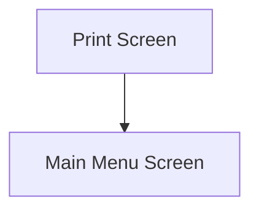

This screen is used to reprint a Customer Shipment

# Flow

# When This Page Is Loaded
The printers are retrieved from Epicor
- See [How MIMS Retrieves The Available Printers](../../../../Printing.md#how-mims-retrieves-the-available-printers)

The [Selected Printer](#printer) is set to the first default Printer

The [Selected Printing Option](#printing-options) is set the first Printing Option

# Controls
## Package Number
This control is used to input the Package Number

## Printing Options
This control is used to select the Printing Option

The following printing options are available
- `Packing Slip
- `Shipping Labels`
- `Both`

## Printer
This control is used to select a Printer from the list of available Printers

## Reprint
This control is used to execute the selected Printing Option and complete the Customer Shipment

### When This Button Is Tapped
The app will validate the selection

If no [Package Number](#package-number) has been selected
- An error with the message, "Please enter a Package Number", is shown

If no [Printing Option](#printing-options) has been selected
- An error with the message, "Please select a print option", is shown

If no [Printer](#printer) has been selected
- An error with the message, "Please select a printer", is shown

The app will try to get the Package from Epicor
- This is done via a REST call to `~/Erp.BO.CustShipSvc/CustShips(Company, PackNum)`

If this is unsuccessful
- The Epicor error is shown to the User

The report is printed in the same way as in [Order Picking](../../../Order_Picking/Order_Picking.md)
- See [Printing](../../../Order_Picking//Epicor_Processes.md#printing)

The app then navigates to the [Home Page](../../../Home_Page.md)