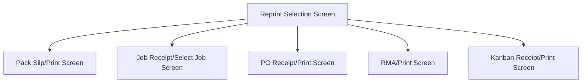

This screen is used to select the type or receipt to re-print

# Flow

# Controls
## Reprint Pack Slip
This button is used to navigate to the Pack Slip reprint

### When This Button Is Tapped
The app will navigate to the [Pack Slip/Print Screen](./Pack_Slip/Print_Screen.md)

## Reprint Job Receipts
This button is used to navigate to the Job Receipts reprint

### When This Button Is Tapped
The app will navigate to the [Job Receipt/Select Job Screen](./Job_Receipt/Select_Job_Screen.md)

## Reprint PO Receipt
This button is used to navigate to the PO Receipt reprint

### When This Button Is Tapped
The app will navigate to the [PO Receipt/Print Screen](./PO_Receipt/Print_Screen.md)

## Reprint RMA Receipt
This button is used to navigate to the RMA Receipt reprint

### When This Button Is Tapped
The app will navigate to the [RMA Receipt/Print Screen](./RMA_Receipt/Print_Screen.md)

## Reprint Kanban Receipt
This button is used to navigate to the Kanban Receipt reprint

### When This Button Is Tapped
The app will navigate to the [Kanban Receipt/Select Job Screen](./Kanban_Receipts/Select_Job_Screen.md)