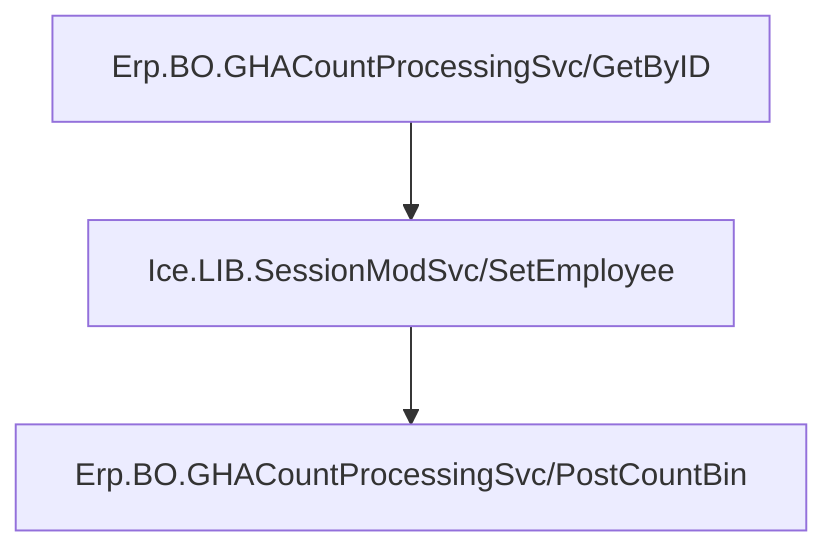
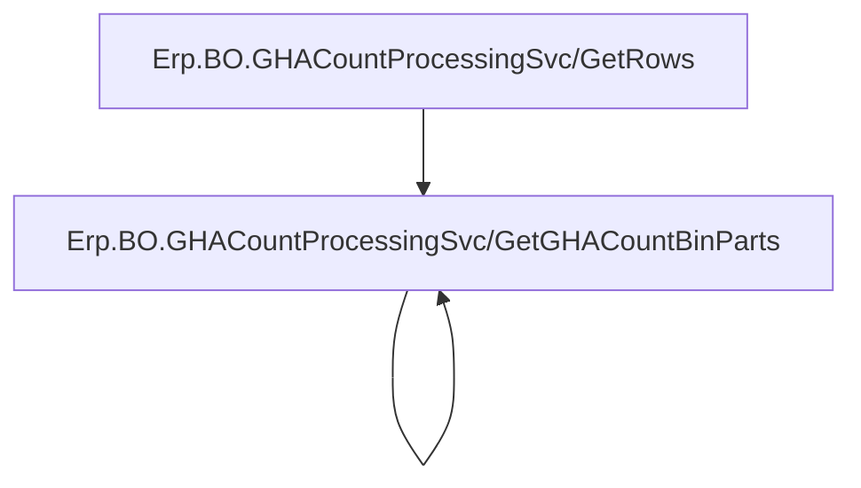
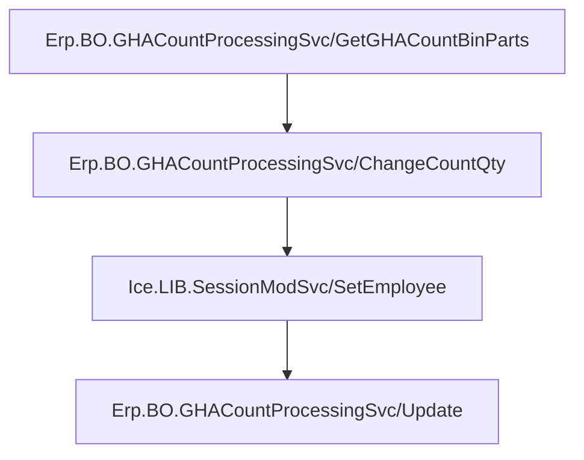
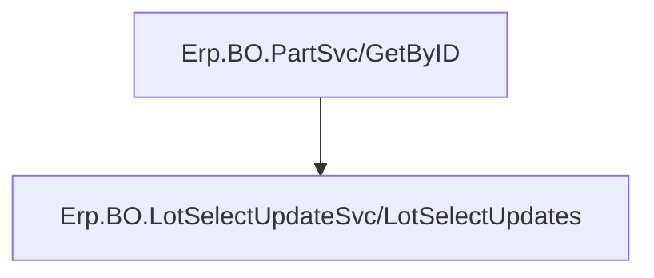
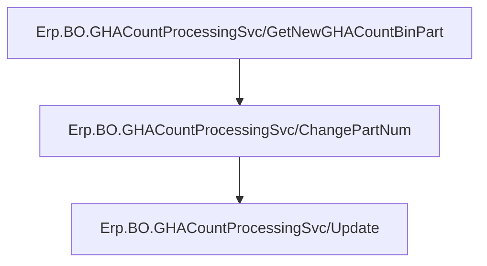
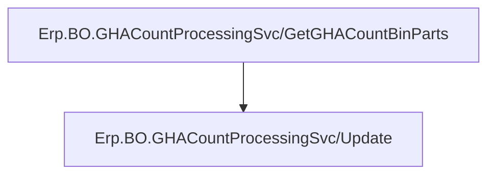

f

# Posting The Count Bin
To Post the Count Bin to Epicor, the following API calls are made in the following order



# Determining The Stocktake Flow
The Stocktake flow is defined by one of the following
- `Lot`
- `Part`
- `MoreParts`
- `Bin`
- `Whse`
- `Complete`

The following REST calls are made in the following order to get all Bin Parts 


*`GetGHACountBinParts` is called for each Bin returned by `GetRows`*

Each iteration of `GetGHACountBinParts` follows the following logic

If the result contains no `WarehouseCode` or `BinNum`
- The iteration skips

Otherwise, the pending Count Bins are retrieved by filtering the result `GHACountBin` object by the following criteria
- `Open == false`
- `WarehouseCode == {WarehouseCode}`
	- Where `{WarehouseCode}` is the selected Warehouse's Code
- `BinNum == {BinNum}`
	- Where `{BinNum}` is the selected Bin's Number

If there is more than one result
- The iteration skips

Otherwise, the pending Count Bin Parts are retrieved by filtering the result `GHACountBinPart` object by the following criteria
- `Entered == false`
- `Skipped == false`
- `PartNum == {PartNum}`
	- Where `{PartNum}` is the selected Part's Part Number
- `WarehouseCode == {WarehouseCode}`
	- Where `{WarehouseCode}` is the selected Warehouse's Code
- `BinNum == {BinNum}`
	- Where `{BinNum}` is the selected Bin's Number

If there is more than one result
- The Stocktake flow will be determined as `Lot`

Otherwise, the pending Count Bin Parts are retrieved by filtering the result `GHACountBinPart` object by the following criteria
- `Entered == false`
- `Skipped == false`
- `WarehouseCode == {WarehouseCode}`
	- Where `{WarehouseCode}` is the selected Warehouse's Code
- `BinNum == {BinNum}`
	- Where `{BinNum}` is the selected Bin's Number

If there is more than one result
- The Stocktake flow will be determined as `Part`

Otherwise, the Pending Count Bins are retrieved by filtering the result `GHACountBinPart` object by the following criteria
- `Open == true`
- `WarehouseCode == {WarehouseCode}`
	- Where `{WarehouseCode}` is the selected Warehouse's Code

If there is more than one result
- The Stocktake flow will be determined as `Bin`

Otherwise the Pending Count Bins are retrieved by filtering the result `GHACountBin` object by the following criteria
- `Open == true`

If there is more than one result
- The Stocktake flow will be determined as `Whse`


# Updating The Stocktake
To Update the Stocktake in Epicor, the following API call are made in the following order


A call to `Erp.BO.GHACountProcessingSvc/GetGHACountBinParts` is made to get the currently selected Part and Lot

Then the new quantity is set

Then a call to `Erp.BO.GHACountProcessingSvc/ChangeCountQty` is made to change the dataset based on the new quantity

Then a call to `Ice.LIB.SessionModSvc/SetEmployee` is made to set the employee of the current session to the current employee

Then a call is `Erp.BO.GHACountProcessingSvc/Update` is made to update the Stocktake in Epicor
# Posting The Count
To Post the Count in Epicor, the following API calls are made in the following order
```mermaid

```

A call is made to `Erp.BO.GHACountProcessingSvc/GetByID` to get the dataset of the Count

Then a call is made to `Ice.LIB.SessionModSvc/SetEmployee` to set the employee of the current session to the current employee

Then a call is made to `Erp.BO.GHACountProcessingSvc/PostCount` to Post the Count in Epicor
# Getting The Stocktake Part Lots
To get the Stocktake Part Lots, the following API calls are made in the following order

```mermaid
flowchart 

A[Erp.BO.GHACountProcessingSvc/GetGHACountBinParts]
B[Erp.BO.PartSvc/Parts]

A --> B
B --> B
```

A call to `~/Erp.BO.GHACountProcessingSvc/GetGHACountBinParts` is made to get the Parts of the selected Count

A call to `Erp.BO.PartSvc/Parts` is then made, for each part, to get the Lot Number

# Creating A New Lot
To create a new Lot, the following API calls are made in the following order


A call to `~/Erp.BO.PartSvc/GetByID` is made to get the selected Part

The the parameters for the next REST call are setup (referred to as `PostData`)

If the `ds.Part[0].AttBatch` field is set to `"M"`
- `PostData.Batch` will be set to `"Stocktake"`

If the `ds.Part[0].AttMfgBatch` field is set to `"M"`
- `PostData.MfgBatch` will be set to `"Stocktake"`

If the `ds.Part[0].AttMfgLot` field is set to `"M"`
- `PostData.MfgLot` will be set to `"Stocktake"`

If the `ds.Part[0].AttHeat` field is set to `"M"`
- `PostData.HeatNum` will be set to `"Stocktake"`

If the `ds.Part[0].AttFirmware` field is set to `"M"`
- `PostData.FirmWare` will be set to `"Stocktake"`

If the `ds.Part[0].AttFirmware` field is set to `"M"`
- `PostData.BestBeforeDt` is set to the current date and time

If the `ds.Part[0].AttBeforeDt` field is set to `"M"`
- `PostData.BestBeforeDt` is set to the current date and time

If the `ds.Part[0].AttMfgDt field is set to `"M"`
- `PostData.MfgDt` is set to the current date and time

If the `ds.Part[0].AttCureDt field is set to `"M"`
- `PostData.CureDt` is set to the current date and time

If the `ds.Part[0].AttExpDt` field is set to `"M"`
- `PostData.ExpireDt` is set to the current date and time

Then a call to `~/Erp.BO.LotSelectUpdateSvc/LotSelectUpdates` is made to create the lot


# Adding A Part To The Lot / Stocktake
To add a Part to the Lot, the following API calls are made in the following order


A call to `~/Erp.BO.GHACountProcessingSvc/GetNewGHACountBinPart` is made to get a new Count Bin Part Dataset

The Part number is then set to the selected Part Number

Then a call to `~/Erp.BO.GHACountProcessingSvc/ChangePartNum` is made to update the default fields with the Part information

Then a call to `~/Erp.BO.GHACountProcessingSvc/Update` is made to save the changes
# Skipping The Stocktake Part
To Skip the Stocktake Part in Epicor, the following API calls are made in the following order



A call is made to `~/Erp.BO.GHACountProcessingSvc/GetGHACountBinParts` to get the selected Part

The `Skipped` field is set to true

Then a call is made to `~/Erp.BO.GHACountProcessingSvc/Update` to save the changes in Epicor