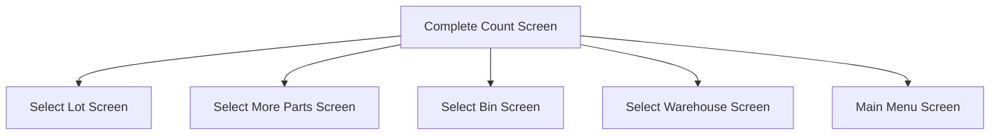

This screen is used to complete the Count and update the Stocktake in Epicor

This screen will also display the following information
- Warehouse Description
- Bin Description
- Part Number
- Lot Number
- Selected Quantity

# Flow

If the flow has been determined as `Lot`
- The Part will be removed from the [Application Storage](../../../Application_Storage.md)
- The app will navigate to the [Select Lot Screen](./Select_Lot_Screen.md)

If the flow has been determined as `MoreParts`
- The Bin is removed from the [Application Storage](../../../Application_Storage.md)
- The app will navigate to the [Select More Parts Screen](./Select_More_Parts_Screen.md)

If the flow has been determined as `Bin`
- The Warehouse will be removed from the [Application Storage](../../../Application_Storage.md)
- This app will navigate to the [Select Bin Screen](./Select_Bin_Screen.md)

If the flow has been determined as `Whse`
- The Count will be removed from the [Application Storage](../../../Application_Storage.md)
- The app will navigate to the [Select Warehouse Screen](./Select_Warehouse_Screen.md)

If the flow has been determined as `Complete`
- The app will navigate back to the [Home Page](../../Home_Page.md)
# Controls
## Update
This control is used to update the Stocktake in Epicor and navigate to the next screen

### When This Button Is Tapped
The Stocktake will be updated in Epicor
- See [Updating The Stocktake](../Epicor_Processes.md#updating-the-stocktake)

The app will then determine the flow of the Stocktake
- See [Determining The Stocktake Flow](../Epicor_Processes.md#determining-the-stocktake-flow)

If the flow is determined as `Part`
- A dialog with the message, "Bin is complete, do you want to add more parts or close?", is shown

If the User chooses "More Parts"
- The Stocktake flow will be set as `MoreParts`

If the User chooses "Close"
- The Stocktake flow will remain as determined

If the Stocktake flow is `Bin`, `Whse` or `Complete`
- The Bin will be posted in Epicor
	- See [Posting The Count Bin](../Epicor_Processes.md#posting-the-count-bin)

If the Stocktake flow is `Complete`
- The Count will be posted in Epicor
	- See [Posting The Count](../Epicor_Processes.md#posting-the-count)

If the Stocktake flow is not `MoreParts`
- The flow of the Stocktake is determined again
	- See [Determining The Stocktake Flow](../Epicor_Processes.md#determining-the-stocktake-flow)

The app will then navigate to the next screen as determined by [Flow](#flow)