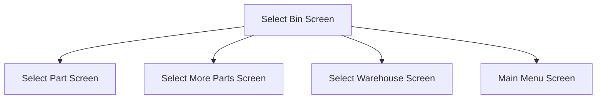

This bin is used to select a Bin from the previously selected Warehouse

# Flow

If the flow has been determined as `Part`
- The app will navigate to the [Select Part Screen](./Select_Part_Screen.md)

If the flow has been determined as `MoreParts`
- The app will navigate to the [Select More Parts Screen](./Select_More_Parts_Screen.md)

If the flow has been determined as `Bin`
- The Bin will be removed from the [Application Storage](../../../Application_Storage.md)
- This app will navigate to the [Select Bin Screen](./Select_Bin_Screen.md)

If the flow has been determined as `Whse`
- The Warehouse will be removed from the [Application Storage](../../../Application_Storage.md)
- The app will navigate to the [Select Warehouse Screen](./Select_Warehouse_Screen.md)

If the flow has been determined as `Complete`
- A prompt with the message, "Stocktake complete", is shown
- The app will navigate back to the [Home Page](../../Home_Page.md)

# When This Page is Loaded
The Warehouse Bins are retrieved from Epicor
- This is done via a REST call to `~/Erp.BO.GHACountProcessingSvc/GHACountProcessings(Company, CountID)/GHACountBins`

# Controls
## Bin List
This control is used to select a Bin from the list of retrieved Bins

### When A Bin Is Tapped
The app will save the selected Bin to the [Application Storage](../../../Application_Storage.md)

The [Selection Logic](#selection-logic) is followed

## Scan
This control is used to scan the Bin using the device's camera

### When This Button Is Tapped
See [Camera Scanning](#camera-scanning)

# Selection Logic
The app will get the parts from the selected Count
- This is done via a REST call to `~/Erp.BO.GHACountProcessingSvc/GetGHACountBinParts`

If one or more Parts are returned
- The app will navigate to the [Select Part Screen](./Select_Part_Screen.md)

If no Parts are found, a different workflow will be triggered

A dialog with the message, "Bin is complete, do you want to add more parts or close?"

If the User selects "More Parts"
- The app will navigate to the [Select More Parts Screen](./Select_More_Parts_Screen.md)

If the User selects no, the app will attempt to Post the Count Bin
- See [Posting The Count Bin](../Epicor_Processes.md#posting-the-count-bin) for further information

Then the app will then determine the flow of the Stocktake to follow
- See [Determining The Stocktake Flow](../Epicor_Processes.md#determining-the-stocktake-flow) for further information

Once the flow has been determined
- The app will navigate to the next screen as defined under [Flow](#flow)

# Scanning
## Camera Scanning
The [Camera Scanning Process](../../../Scanning.md#camera-scanning) is triggered to allow the user to scan a barcode

Then logic defined under [How The Scanned Barcode Is Handled](#how-the-scanned-barcode-is-handled) is followed

## Data Wedge Scanning
When a barcode is scanned by a data wedge, the logic defined under [How The Scanned Barcode Is Handled](#how-the-scanned-barcode-is-handled) is followed

## How The Scanned Barcode Is Handled
The barcode is validated against the defined [Bin Format](../../../Scanning.md#bin-format)

If the barcode is invalid:
- The relevant [Barcode Validation Error](../../../Scanning.md#barcode-validation-errors) will be shown to the user

Then the app will attempt to find the Bin from the [Bin List](#bin-list)

If no Bin is found
- An error with the message, "Bin '{Bin}' not found"
	- Where `{Bin}` is the interpreted Bin Number from the barcode

If a Bin is found
- The [Selection Logic](#selection-logic) is followed