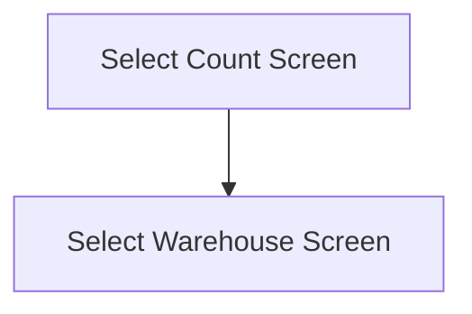

This screen is used to select a Count to use for the Stocktake process

# Flow

When the user taps the [Select Button](#select)
- The app will navigate to the [Select Warehouse Screen](./Select_Warehouse_Screen.md)

# When This Page Is Loaded
The Counts are retrieved from Epicor
- This is done via a REST call to `~/Erp.BO.GHACountProcessingSvc/GHACountProcessings`

The list of [Counts](#count) is updated with these Counts

# Controls
## Count
This control is used to select a Count to use for the Stocktake process

## Select
This control is used to complete the selection and navigate to the next screen

### When This Button Is Tapped
The app will navigate to the next screen as defined under [Flow](#flow)
