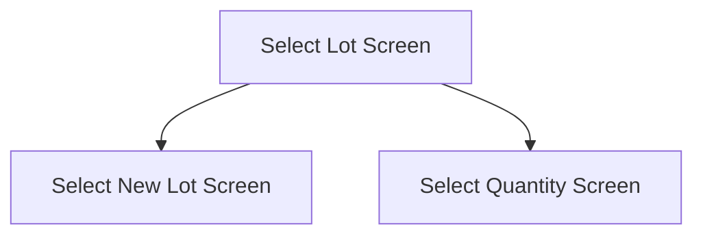

This screen is used to select a Lot to add to the Stocktake

# Flow

Given that the User has chosen to create a new Lot, after selecting a Lot that doesn't exist
- The app will navigate to the [Select New Lot Screen](./Select_New_Lot_Screen.md)

Given that the Part has been added to the Lot successful, after the choosing a Lot that does exist
- The app will navigate to the [Select Quantity Screen](./Select_Quantity_Screen.md)

# When This Page Is Loaded
The Part Lots are retrieved from Epicor
- See [Getting The Stocktake Part Lots](../Epicor_Processes.md#getting-the-stocktake-part-lots)

# Controls
## Part Lot List
This control is used to select a Part Lot

### When A Lot Is Selected
The Lot is saved to the [Application Storage](../../../Application_Storage.md)

The app will then navigate to the [Select Quantity Screen](./Select_Quantity_Screen.md)

## Scan
This control is used to scan a Part Lot using the device's camera

### When This Button Is Tapped
See [Camera Scanning](#camera-scanning)

## Add Lot
This control is used to add a new Lot Number

### When This Button Is Tapped
The app will navigate to the [Select New Lot Screen](./Select_New_Lot_Screen.md)

# Selection Logic
The app will validate the selected Lot Number
- This is done via a REST call to `~/Erp.BO.LotSelectUpdateSvc/LotSelectUpdates`

If no lot is returned
- A prompt with the message, "Lot not on file, create new?", is shown

If the User selects "Yes"
- The app will create the Lot
	- See [Creating A New Lot](../Epicor_Processes.md#creating-a-new-lot)

If the User selects "No"
- Nothing will happen

Given that a lot is returned

The app will add the Part to the selected Lot
- See [Adding A Part To The Lot](../Epicor_Processes.md#adding-a-part-to-the-lot--stocktake)

The app then navigates to the [Select Quantity Screen](./Select_Quantity_Screen.md)

# Scanning
## Camera Scanning
The [Camera Scanning Process](../../../Scanning.md#camera-scanning) is triggered to allow the user to scan a barcode

Then logic defined under [How The Scanned Barcode Is Handled](#how-the-scanned-barcode-is-handled) is followed

## Data Wedge Scanning
When a barcode is scanned by a data wedge, the logic defined under [How The Scanned Barcode Is Handled](#how-the-scanned-barcode-is-handled) is followed

## How The Scanned Barcode Is Handled
The barcode is validated against the defined [Lot Format](../../../Scanning.md#lot-format)

If the barcode is invalid:
- The relevant [Barcode Validation Error](../../../Scanning.md#barcode-validation-errors) will be shown to the user

Then the app will set the [Selected Lot Number](#part-lot-list) to the value of the barcode

Then the [Selection Logic](#selection-logic) is followed