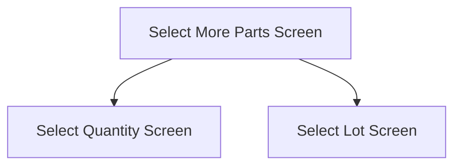

This screen is used to select more parts

# Flow

Given that the User has selected a non lot-tracked Part
- The app will navigate to the [Select Quantity Screen](./Select_Quantity_Screen.md)

Given that the User has selected a lot-tracked Part
- The app will navigate to the [Select Lot Screen](./Select_Lot_Screen.md)

# When This Page Is Loaded
The app will retrieve the parts from the Count Bin
- This is done via a REST call to `~/Erp.BO.GHACountProcessingSvc/GetGHACountBinParts`

# Controls
## Part
This control is used to enter the Part Number of the Part to select

## Scan
This control is used to scan the Part Number of the Part to select using the device's camera

### When This Button Is Tapped
See [Camera Scanning](#camera-scanning)

## Select
This control is used to validate and complete the selection

### When This Button Is Tapped
The app will validate the selection

If no [Part](#part) has been entered
- An error with the message, "You need to enter a Part Number", is shown

The app will get the Part from the Stocktake
- This is done via REST call to `~/Erp.BO.GHACountProcessingSvc/GetGHACountBinParts`

If the Part is not in the Stocktake
- The app will add the Part to the Stocktake
	- See [Adding A Part To The Lot / Stocktake](../Epicor_Processes.md#adding-a-part-to-the-lot--stocktake)

If the Part is in the Stocktake and is not lot-tracked
- A prompt with the message, "This Part has been counted in this bin, do you want to replace the count?"

If the User selects "No"
- This logic will stop

Then the app will navigate to the next screen as defined under [Flow](#flow)

# Scanning
## Camera Scanning
The [Camera Scanning Process](../../../Scanning.md#camera-scanning) is triggered to allow the user to scan a barcode

Then logic defined under [How The Scanned Barcode Is Handled](#how-the-scanned-barcode-is-handled) is followed

## Data Wedge Scanning
When a barcode is scanned by a data wedge, the logic defined under [How The Scanned Barcode Is Handled](#how-the-scanned-barcode-is-handled) is followed

## How The Scanned Barcode Is Handled
The barcode is validated against the defined [Part Format](../../../Scanning.md#part-format)

If the barcode is invalid:
- The relevant [Barcode Validation Error](../../../Scanning.md#barcode-validation-errors) will be shown to the user

Then the app will set the [Selected Part Number](#part) to the value of the barcode

Then the [Select Button Logic](#when-this-button-is-tapped-1) is followed