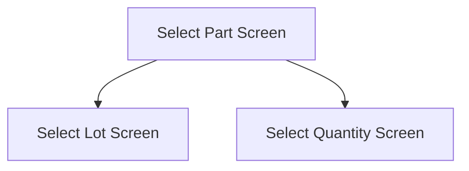

This screen is used to select the Part to use for the Stocktake process

# Flow

If the selected Part is lot-tracked
- The app will navigate to the [|Select Lot Screen](./Select_Lot_Screen.md)

If the selected Part is not lot-tracked
- The app will navigate to the [Select Quantity Screen](./Select_Quantity_Screen.md)

# When This Page Is Loaded
The Count Bin Parts are retrieved
- This is done via a REST call to `~/Erp.BO.GHACountProcessingSvc/GetGHACountBinParts`

# Controls
## Part List
This control is used to select a Part

### When A Part Is Tapped
The app will save the selected Part to the [Application Storage](../../../Application_Storage.md)

If the Part is lot-tracked
- The app will navigate to the [Select Lot Screen](./Select_Lot_Screen.md)

If the Part is not lot-tracked
- The app will navigate to the [Select Quantity Screen](./Select_Quantity_Screen.md)

## Scan
This control is used to scan a Part using the device's camera

### When This Button Is Tapped
See [Camera Scanning](#camera-scanning)

# Selection Logic
The app will validate the selected Part

If the Part Number has not been selected
- An error with the message, "Invalid Part Number, please try again", is shown

The app will validate the selected Part against the Stocktake in Epicor, by checking if the Part is within the Stocktake
- This is done via a REST call to `~/Erp.BO.GHACountProcessingSvc/GetGHACountBinParts`

If the Part Number is not lot-tracked and not apart of the Stocktake
- A prompt with the message "Part not in bin, add?", is shown

If the User selects "Yes"
- The Part will be added to the Stocktake
	- See [Adding A Part To The Lot / Stocktake](../Epicor_Processes.md#adding-a-part-to-the-lot--stocktake)

Otherwise, if the Part has been counted
- A prompt with the message, "Part has been counted in this bin, do you want to replace the count?"

If the User chooses "No"
- This logic will end

If the Part is lot-tracked and no lot number has been selected
- The app will navigate to the [Select Lot Screen](./Select_Lot_Screen.md)

If the Part is lot-tracked and a lot number has been selected
- The app will validate the selected lot number
	- This is done via a REST call to `Erp.BO.LotSelectUpdateSvc/LotSelectUpdates`

If the lot number is not valid
- A prompt with the message, "Lot not on file, create new?", is shown

If the User selects "Yes"
- The lot is added to the Stocktake
	- See [Creating A New Lot](../Epicor_Processes.md#creating-a-new-lot)

If the User selects "No"
- This logic will end

The app will then add the Part to the Stocktake
- See [Adding A Part To The Lot / Stocktake](../Epicor_Processes.md#adding-a-part-to-the-lot--stocktake)

Then the app will navigate to the next screen as defined under [Flow](#flow)

# Scanning
## Camera Scanning
The [Camera Scanning Process](../../../Scanning.md#camera-scanning) is triggered to allow the user to scan a barcode

Then logic defined under [How The Scanned Barcode Is Handled](#how-the-scanned-barcode-is-handled) is followed

## Data Wedge Scanning
When a barcode is scanned by a data wedge, the logic defined under [How The Scanned Barcode Is Handled](#how-the-scanned-barcode-is-handled) is followed

## How The Scanned Barcode Is Handled
The barcode is validated against the defined [Part Lot Format](../../../Scanning.md#part-lot-format) 

If the barcode is invalid:
- The relevant [Barcode Validation Error](../../../Scanning.md#barcode-validation-errors) will be shown to the user

Then the app will set the selected Part and selected Lot as per the interpreted values from the barcode

Then the [Selection Logic](#selection-logic) is followed