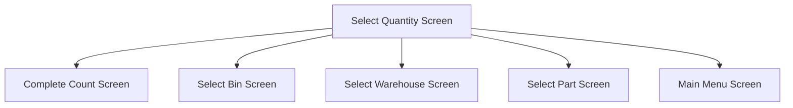

This screen is used to select the Quantity of the selected Part to add to the selected Count

# Flow

If the Stocktake flow is determined as `MoreParts`
- The Bin will be removed from the [Application Storage](../../../Application_Storage.md)
- The app will navigate to the [Select More Parts Screen](./Select_More_Parts_Screen.md)

if the Stocktake flow is determined as `Bin`
- The Warehouse will be removed from the [Application Storage](../../../Application_Storage.md)
- The app will navigate to the [Select Bin Screen](./Select_Bin_Screen.md)

If the Stocktake flow is determined as `Whse`
- The Count will be removed from the [Application Storage](../../../Application_Storage.md)
- The app will navigate to the [Select Warehouse Screen](./Select_Warehouse_Screen.md)

If the Stocktake flow is determined as `Part`
- The app will navigate to the [Select Part Screen](./Select_Part_Screen.md)

If the Stocktake flow is determined as `Complete`
- The app will navigate to the [Home Page](../../Home_Page.md)

# Controls
## Quantity
This control is used to enter the quantity of the Part to add to the selected Count

## Skip
This control is used to skip the quantity screen

### When This Button Is Tapped
The Part is skipped in Epicor
- See [Skipping The Stocktake Part](../Epicor_Processes.md#skipping-the-stocktake-part)

The app will check if there are any Count Bin Parts remaining
- This is done via a REST call to `~/Erp.BO.GHACountProcessingSvc/GetGHACountBinParts`

If there are no Parts remaining
- A prompt with the message, "Bin is complete, do you want to add more parts or close?", is shown

If the User selects "More Parts"
- The app navigates to the [Select More Parts Screen](./Select_More_Parts_Screen.md)

If the User selects "Close"
- The Count Bin will be completed in Epicor
	- See [Posting The Count Bin](../Epicor_Processes.md#posting-the-count-bin)

The app will get the Stocktake flow
- See [Determining The Stocktake Flow](../Epicor_Processes.md#determining-the-stocktake-flow)

The app will then navigate to the next screen as defined under [Flow](#flow)

## Calc
This control is used to show the calculator to calculate the [Selected Quantity](#quantity)

### When This Button Is Tapped
The [Calculator](../Calculator.md) will be shown

## Enter
This control is used to validate and complete the selection

### When This Button Is Tapped
The app will navigate to the [Complete Count Screen](./Complete_Count_Screen.md)