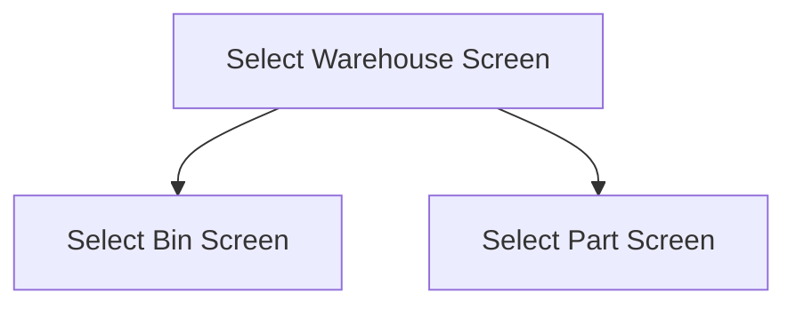

This screen is used to select the Warehouse to use for the Stocktake process

# Flow

If the user selects a Warehouse from the [Warehouse List](#warehouse-list)
- The app will navigate to the [Select Bin Screen](./Select_Bin_Screen.md)

If the user scans a barcode containing the Warehouse code and Bin Number
- The app will navigate to the [Select Part Screen](./Select_Part_Screen.md)

# When This Page Is Loaded
The app will retrieve the Count Bins from Epicor
- This is done via a REST call to `~/Erp.BO.GHACountProcessingSvc/GHACountProcessings(Company, CountID)/GHACountBins`
	- This will look for Open Bins (`Open == true`)

These results are then grouped by Warehouse and are used to update the [Warehouse List](./Select_Warehouse_Screen.md)

# Controls
## Warehouse List
This control is used to show the Warehouses that the user can pick from for Stocktake

### When A Warehouse Is Tapped
The app will save the selected Warehouse to [Application Storage](../../../Application_Storage.md)

The app will navigate to the [Select Bin Screen] as defined under [Flow](#flow)

## Scan
This control is used to scan a Warehouse using the device's camera

### When This Button Is Tapped
See [Camera Scanning](#camera-scanning)

# Scanning
## Camera Scanning
The [Camera Scanning Process](../../../Scanning.md#camera-scanning) is triggered to allow the user to scan a barcode

Then logic defined under [How The Scanned Barcode Is Handled](#how-the-scanned-barcode-is-handled) is followed

## Data Wedge Scanning
When a barcode is scanned by a data wedge, the logic defined under [How The Scanned Barcode Is Handled](#how-the-scanned-barcode-is-handled) is followed

## How The Scanned Barcode Is Handled
The barcode is validated against the defined [Warehouse Bin Format](../../../Scanning.md#warehouse-bin-format)

If the barcode is invalid:
- The relevant [Barcode Validation Error](../../../Scanning.md#barcode-validation-errors) will be shown to the user

Then the app will attempt to find the Warehouse from the [Warehouse List](#warehouse-list)

If no Warehouse is found
- An error with the message, "Warehouse '{Warehouse}' not found", is shown
	- Where `{Warehouse}` is the interpreted Warehouse Code from the barcode

Then the app will attempt to find the Bin from the scanned Warehouse

If no Bin is found
- An error with the message, "Bin '{Bin}' not found'"
	- Where `{Bin}` is the interpreted Bin Number from the barcode

If both a Warehouse and Bin are found
- The app will navigate to the [Select Part Screen](./Select_Part_Screen.md), as defined under [Flow](#flow)