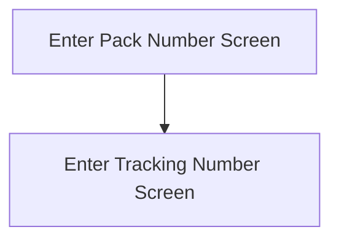

This screen is used to enter the Pack number of the Customer Shipment

# Flow

If the User has entered a valid Pack Number, when the [Select Button](#select) is tapped
- The app will navigate to the [Enter Tracking Number Screen](./Enter_Tracking_Number_Screen.md)

# Controls
## Pack Number
This control is used to enter the Pack Number of the Customer Shipment

## Scan
This control is used to scan the Pack Number of the Customer Shipment using the device's camera

### When This Button Is Tapped
See [Camera Scanning](#camera-scanning)

## Select
This control is used to validate the selection and navigate to the next page, as described under [Flow](#flow)

### When This Button Is Tapped
The app will validate the selection

If the [Pack Number](#pack-number) is empty
- An error with the message, "Please enter a Pack Number", is show

Otherwise, the app will then try to get the Customer Shipment from Epicor
- This is done via a REST call to `~/Erp.BO.CustShipSvc/CustShips(Company, PackNum)`

If this REST call is unsuccessful (For example, "Record not found")
- An error with the message, that Epicor returned, will be shown

Otherwise the app will navigate to the next screen as described in [Flow](#flow)

# Scanning
## Camera Scanning
The [Camera Scanning Process](../../../Scanning.md#camera-scanning) is triggered to allow the user to scan a barcode

See [How The Scanned Barcode Is Handled](#how-the-scanned-barcode-is-handled) 

## Data Wedge Scanning
When a barcode is scanned by a data wedge, the logic defined under [How The Scanned Barcode Is Handled](#how-the-scanned-barcode-is-handled) is followed

## How The Scanned Barcode Is Handled
The barcode is validated against the defined [Pack Barcode Format](../../../Scanning.md#package-format) 

If the barcode is invalid
- The relevant [Barcode Validation Error](../../../Scanning.md#barcode-validation-errors) will be shown to the user

Otherwise, the [Select Button Logic](#when-this-button-is-tapped-1) is followed