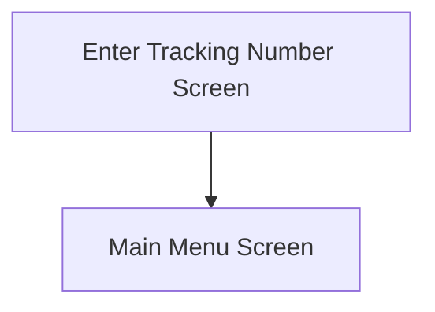

This screen is used to enter the new Tracking Number to update the previously selected Customer Shipment

# Flow

Given that the Tracking Number was updated successfully
- The app will navigate to the [Home Page](../../Home_Page.md)

# Controls
## Tracking Number
This control is used to enter the new Tracking Number to update the Customer Shipment with

## Scan
This control is used to scan the new Tracking Number with the device's camera

### When This Button Is Tapped
See [Camera Scanning](#camera-scanning)

## Update
This control is used to validate the selection, update the Tracking Number in Epicor and navigate to the next screen

### When This Button Is Tapped
The app will validate the selection

If the [Tracking Number](#tracking-number) is empty
- An error with the message, "Please enter a Tracking Number", is shown

The app will then update the Tracking Number against the selected Customer Shipment in Epicor
- See [How The Tracking Number Is Updated In Epicor](../How_The_Tracking_Number_Is_Update_In_Epicor.md)

Then the app will navigate to the next screen, following the logic defined under [Flow](#flow)

# Scanning
## Camera Scanning
The [Camera Scanning Process](../../../Scanning.md#camera-scanning) is triggered to allow the user to scan a barcode

See [How The Scanned Barcode Is Handled](#how-the-scanned-barcode-is-handled) 

## Data Wedge Scanning
When a barcode is scanned by a data wedge, the logic defined under [How The Scanned Barcode Is Handled](#how-the-scanned-barcode-is-handled) is followed

## How The Scanned Barcode Is Handled
The barcode is validated against the defined [Tracking Number Barcode Format](../../../Scanning.md#tracking-number-format)

If the barcode is invalid
- The relevant [Barcode Validation Error](../../../Scanning.md#barcode-validation-errors) will be shown to the user

The [Tracking Number](#tracking-number) is updated with the value of the barcode

Then the [Update Button Logic](#when-this-button-is-tapped-1) is followed