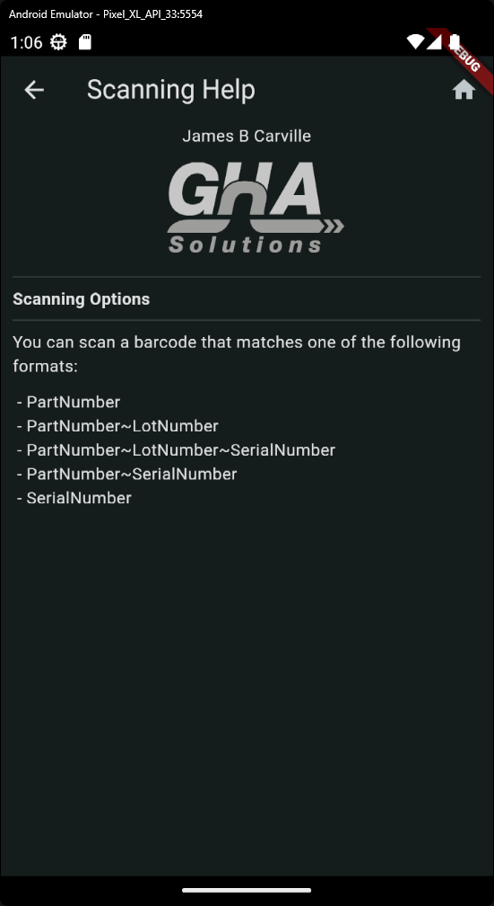
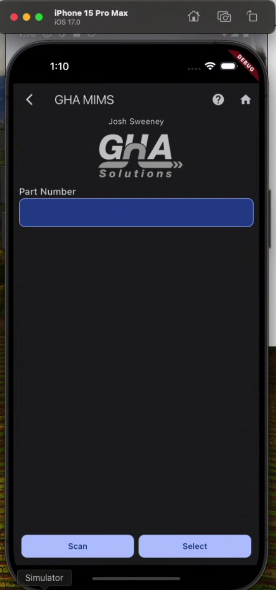

## Integration Testing
The deployment pipeline has been modified to run Integration Tests for Android & iOS before deployment

Integration Tests have been created for:
- The Login Screen
- The Change Site Screen
- The Applets Screen
- The Part Enquiry Applet
- The Bin Enquiry Applet

### Implemented Integration Tests
#### Login Screen
`cannot login if no employee is selected`
`cannot login if no site is selected`
`cannot login if pin is required`
`shows error if pin is incorrect`
`automatically selects site if employee is apart of only one site`
`can login if employee and site is selected and employee has no pin`
`can login if employee, site and pin is valid`
`remembers last login`
`cannot change site until employee has been selected`
`cannot enter pin until employee has been selected`
`cannot enter pin if employee does not have a pin`

#### Applets Screen
`should only show relevant applets if employee has no role`
`should only show relevant applets if employee is a material handler`
`should only show relevant applets if employee handles shipping / receiving`
`should only show relevant applets if employee is a shop supervisor`
`should only show relevant applets if employee is a warehouse manager`
`should navigate to Part Enquiry when Part Enquiry button is tapped`
`should navigate to Bin Enquiry when Part Enquiry button is tapped`
`can change site`

#### Change Site Screen
`should show currently logged in employee`
`should not be able to change employee`
`should show currently selected site`
`should be able to change selected site`
`employee and site should be cleared when Log Out button is tapped`
`should automatically logout if current employee contains one site`

#### Part Enquiry
`Shows error if input is empty`
`Shows results if barcode contains valid part number`
`Shows error when part is not found`
`Shows error when part is not found`
`Shows error when lot is not found`
`Shows error when lot does not match part`
`Shows matching results when part and lot are found`
`Shows error when part is not found`
`Shows error when lot is not found`
`Shows error when serial is not found`
`Shows only one result when part, lot and serial are found`
`Shows error when part is not found`
`Shows error when serial is not found`
`Shows only one result when part and serial is valid`
`Shows error when serial is not found`
`Shows only one result when serial is valid`
`shows help when help button is tapped`
`shows scanning view when scan button is tapped`
`does not show serials when Part Bin is tapped and Part is not Serial Tracked`
`shows serials when Part Bin is tapped and Part is Serial Tracked`
`home button works on enter part page`
`home button works on help page`
`home button works on results page`
`home button works on serials page`

#### Bin Enquiry
`should be able to select warehouse`
`should not be able to select bin if no warehouse has been selected`
`should be able to select bin`
`should show error if no warehouse has been selected`
`should show error if no bin has been selected`
`should show results if warehouse and bin has been selected`
`scanning page is shown when the Scan button is tapped`
`should show help when the help button is tapped`
`should navigate to home when home button is tapped on the select warehouse bin secreen`
`should navigate to home when home button is tapped on the help screen`
`should navigate to home when home button is tapped on the results screen`

## `2.1 Common Features`
### `2.1.10 Cancel Scan`
The scanning screen now contains a button to cancel the scanning process

### `2.1.11 Remove Keyboard Icon`
Inputs no longer contain the keyboard icon

### `2.1.13 Home Button`
The home button has been added to all pages in Part Enquiry and Bin Enquiry. It navigates back to the applets screen when tapped, like the current version.

## `2.4.2 Various Bugs`
NOTE: The fourth "bug" was converted to a new phase `2.5.10 Change Site`

### `2.4.2.1 Registration Screen`
- The iPhone scroll bar no longer covers the buttons
- The buttons no longer overflow off the screen

### `2.4.2.2 Welcome Screen`
- The iPhone scroll bar no longer covers the buttons
- The buttons no longer overflow off the screen

### `2.4.2.3 Settings Screen`
- The iPhone scroll bar no longer covers the buttons
- The buttons no longer overflow off the screen
- The Unregister button is now aligned

### `2.5 Login`
- Replaced Site autocomplete with picker
- Improved autocomplete controls
- If an Employee only has one site, it is automatically selected

## `2.5.4 Restore Last Login`
- The last site is now restored once again
- The employee and site can be amended

### `2.5.8 Spinning Wheel`
- The app should no longer get stuck when logging out and back in again

### `2.5.9 Change Site`
The Change Site process has been ported from the old app to the new app with the same functionality.
- It is accessed via the logout button, in the top right of the Applets screen
- If the employee has only one site, they are automatically logged out and the screen is skipped
- If the employee has more than one site, they can change the site or choose to logout

## `2.6.1 Banner`
The banner no longer runs over the buttons on the settings page

## `2.7.2 Layout Changes`
The applet buttons have been moved down on the page

## `2.8 Part Enquiry`

### `2.8.1 Part Enquiry Request Pg.`

#### `2.8.1.2 Test Fail`
The keyboard symbol has been removed from the Part Number input

### `2.8.1.3 Help`
The help screen has been ported over from the existing app

### `2.8.2 Part Enquiry Results Pg.`

#### `2.8.2.3 Icons Part Enquiry`
The icons have been removed from the results and has been replaced with the existing design & layout

### `2.8.3 Lot & Serial Filtering`
Part Enquiry now supports the following barcode formats, as per the current version
- `PartNumber`
- `PartNumber~LotNumber`
- `PartNumber~LotNumber~SerialNumber`
- `PartNumber~SerialNumber`
- `SerialNumber`

If a lot or serial is provided, the resulting Part Bins are filtered by the Lot Number or Serial Number

### `2.8.4 Serial List`
If the user has entered a serialized part, when they tap on a part bin, the serials inside that part bin will be shown in a list.

### `2.8.5 Banner Overrun`
The banner no longer runs over the scan and select button

## `2.9 Bin Enquiry`

### `2.9.1.2 Help`
The help screen has been ported over from the existing app

