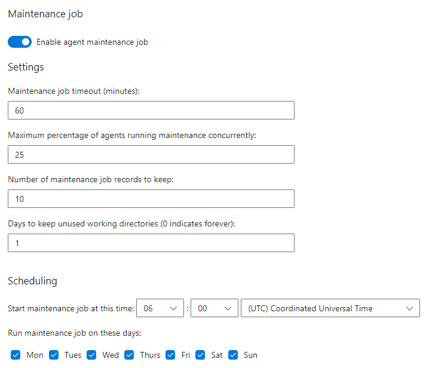

# Agent Maintenance

Each agent pool has a Maintenance Task set up that will clean up the `C:\agent` folder on each agent

The below screenshot shows the settings used on each agent

## Docker System Prune Task

Each agent has a Task, setup in Task Scheduler, that will run the `docker system prune -f` command as `NT AUTHORITY\SYSTEM` with Administrator privileges

This is done to reduce the size taken by `D:\dockerdata`
