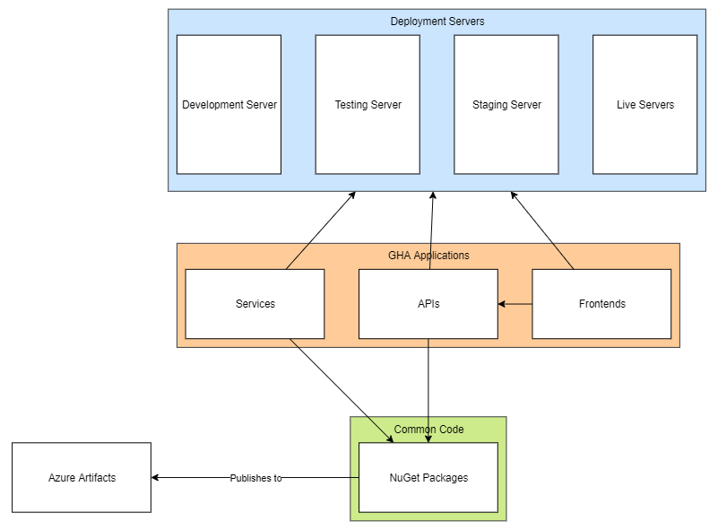

# Deployment

## Overview

The above diagram is an overview of the deployment architecture of GHA Solutions' applications

- Services and APIs share common code using `NuGet` packages
- `NuGet` packages are stored with Azure Artifacts
- Changes to `Common Code` is automatically published as a `NuGet` package for use in other projects
- Frontends are independent of `Common Code` and typically only interface with the relevant API's
- Changes to `GHA Applications` are automatically published to the relevant `Deployment Server`
  - The server is determined by the changed git branch being one of `develop`, `testing`, `staging` or `release`

## Contents

- [Environments and Servers](./environments-and-servers.md)
- [Applications](./applications.md)
- [Nuget Packages](./nuget-packages.md)
- [Naming Conventions](./naming-conventions.md)
- [Deployment Strategies](./deployment-strategies.md)
- [Azure DevOps](./azure-devops.md)
  - [Azure DevOps Environments](./azure-devops-environments.md)
  - [Azure DevOps Pipelines](./azure-devops-pipelines.md)
  - [Azure DevOps Deployment Project](./azure-devops-deployment-project.md)
    - [`azure-templates` Repository](./azure-devops-azure-templates-repository.md)
    - [`Deployment` Repository](./azure-devops-deployment-repository.md)
  - [Agent Maintenance](./azure-devops-agent-maintenance.md)
- [(Guide) Creating Pipelines](./creating-pipelines-guide.md)
- [(Guide) Local Development](./local-development-guide.md)
- [(Guide) Redeployment](redeployment-guide.md)