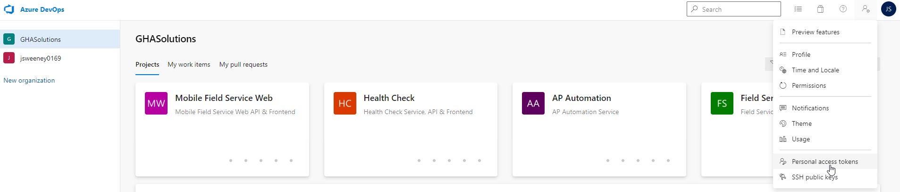
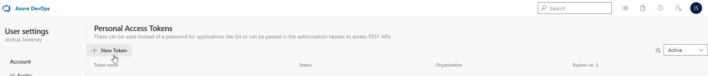
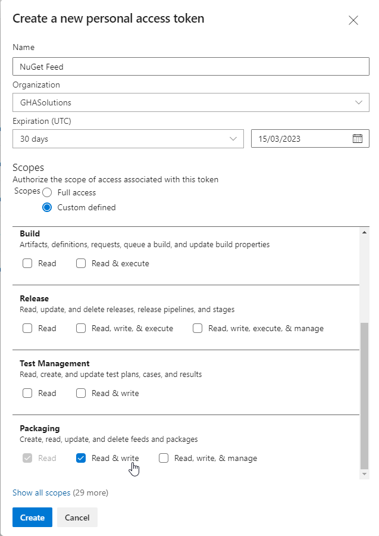

# Local Development Guide

This page describes the process required to setup a repository for local development

- [Connecting To The NuGet Stream](#connecting-to-the-nuget-stream)
- [Secrets](#secrets) *NOTE: This is subject to change in the future*

## Connecting To The NuGet Stream

Azure Artifacts is used for the NuGet repository

*Instructions for connecting to the NuGet Stream can be found on Azure DevOps by clicking on any project and navigating to `Artifacts > Connect to feed`, although the following section will summarize the steps*

## Required Tools

[.NET Core SDK (2.1.400+)](https://go.microsoft.com/fwlink/?linkid=2103972)

- A version of the .NET Core SDK that is greater than 2.1.400 is required

[NuGet Credential Provider](https://go.microsoft.com/fwlink/?linkid=2099625)

- This is a link to the GitHub repository for the NuGet Credential Provider, follow the installation instructions for the relevant platform

## Adding The NuGet Feed

The NuGet feed must be added to the default `nuget.config` file

- On **Windows**, this file is located at `~/AppData/Roaming/NuGet/NuGet.Config`
- On **MacOS**, this file is located at `~/.config/NuGet/NuGet.Config` or `~/.nuget/NuGet/NuGet.Config`

Add the following line to the `nuget.config` file

```xml
...
<add key="GHASolutions" value="https://pkgs.dev.azure.com/GHASolutions/_packaging/GHASolutions/nuget/v3/index.json"/>
...
```

*Example `nuget.config` file*

```xml
<?xml version="1.0" encoding="utf-8"?>
<configuration>
 <packageSources>
  <add key="nuget.org" value="https://api.nuget.org/v3/index.json" protocolVersion="3" />
  <add key="GHASolutions" value="https://pkgs.dev.azure.com/GHASolutions/_packaging/GHASolutions/nuget/v3/index.json"/>
 </packageSources>
</configuration>
```

### Authorization

Open a new terminal and enter the following command

```sh
dotnet restore --interactive
```

Once entered, either

- A new window in which a valid login to Azure DevOps must be provided
- The terminal will provide a link with a code that must both be pasted into a browser window in which a valid login to Azure DevOps must be provided

Future NuGet operations should not require further authorization

- Refer to [Potential Problems](#potential-problems)

### Potential Problems

#### Ensure Pre-releases Are Enabled

If no packages can be found in an IDE, it may be because the `Prerelease` checkbox is unchecked

- Check the relevant checkbox to view pre-release packages

A `nuget.config` file must be placed in the same directory as the `.csproj` file

#### Rider Integrated Credential Provider

The `Rider Integrated` credential provider can have issues connecting to Azure Artifacts, as such change the following setting to use both the default NuGet provider before the `Rider Integrated` provider

1. Go to `Tools > NuGet > NuGet Settings`
2. At the bottom, change the `Use credential providers (requires restart)` setting to `NuGet/.NET CLI Plugins Then Rider Integrated`

#### NuGet Credential Provider

If the [NuGet Credential Provider](https://go.microsoft.com/fwlink/?linkid=2099625) is not working at all, a work around is to generate a Personal Access Token (PAT) in Azure DevOps and provide this as the `password` to the `nuget.config` file

**1. Navigate to the Personal Access Tokens screen on Azure DevOps**


**2. Click on `New Token`**


**3. Create a New Token for the NuGet feed, ensuring that `Read & write` is checked under `Packaging`**


**4. Copy the generated token to the `nuget.config` file, specifying a username as shown below**

```xml
<?xml version="1.0" encoding="utf-8"?>
<configuration>
 <packageSources>
  <add key="nuget.org" value="https://api.nuget.org/v3/index.json" protocolVersion="3" />
  <add key="GHASolutions" value="https://pkgs.dev.azure.com/GHASolutions/_packaging/GHASolutions/nuget/v3/index.json"/>
 </packageSources>
 <packageSourceCredentials>  
  <GHASolutions>
   <add key="username" value="GHASolutions" />  
   <add key="clearTextPassword" value="{PAT_TOKEN}"/>  
  </GHASolutions>
 </packageSourceCredentials>
</configuration>
```

## Secrets

### `launchSettings.json`

Current Secret management requires environment variables to be setup to deploy / develop the application

The `launchSettings.json` file can be used to provide these variables in a more convenient way

- **This file should not be committed to Source Control**
- An entry in `.gitignore` has been made for each application to enforce this

A `launchSettings.json` file can be found in the `Development Team` vault in `1Password` for each application

- Download and copy this file to `./Properties/launchSettings.json`

In Visual Studio or Rider, ensure that the correct launch configuration is set in order for the environment variables to be set

Alternatively, the environment variables can be manually set on the running system though it is more cumbersome
